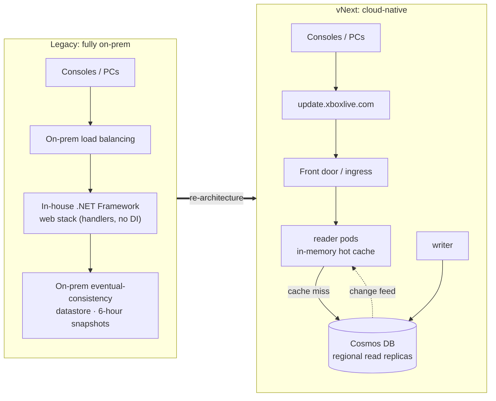
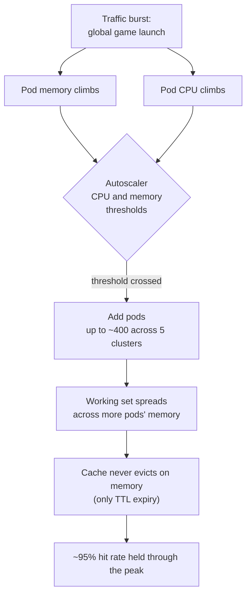
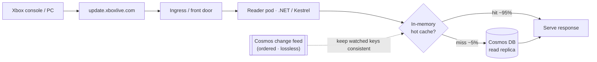
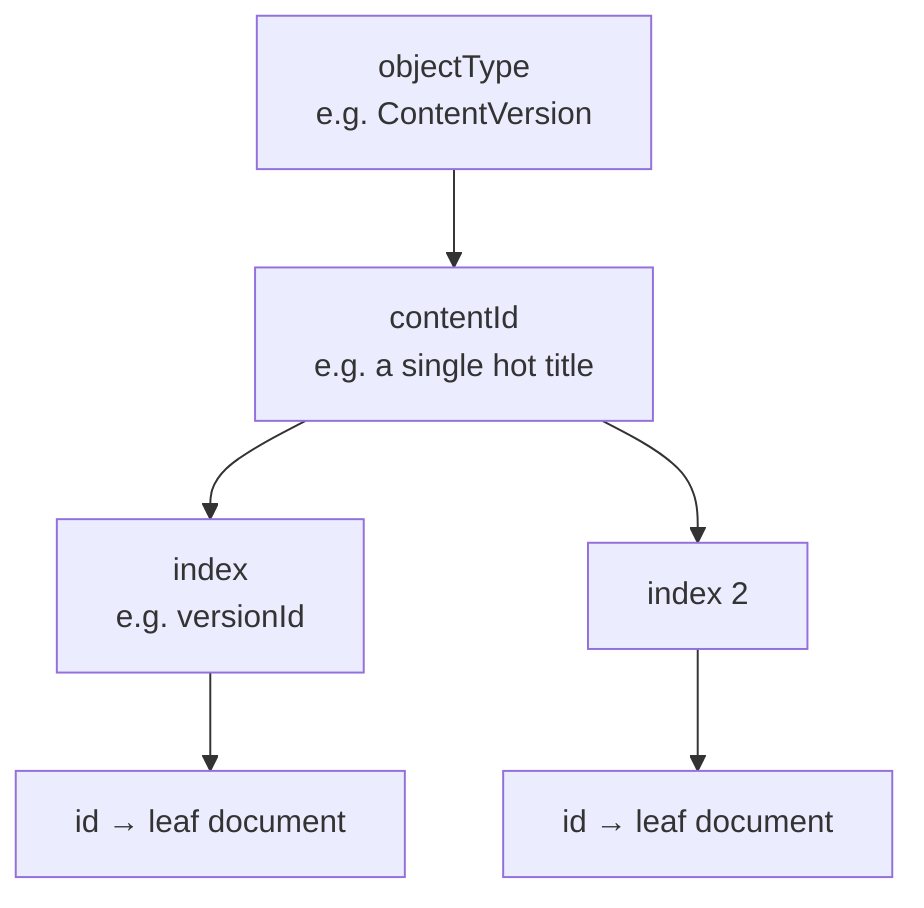
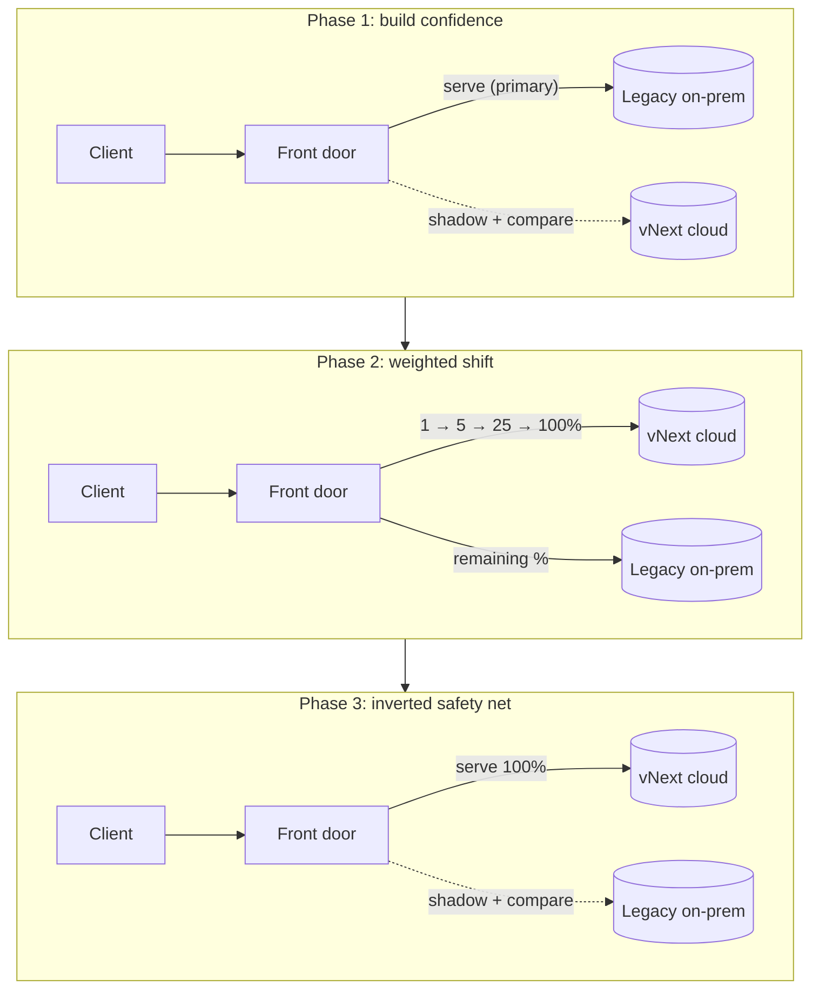
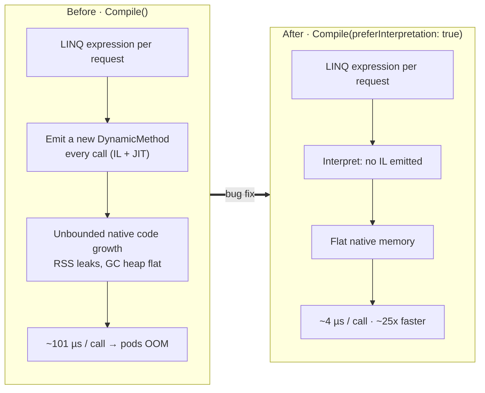

When a big game ships a new season (a Fortnite chapter, a Call of Duty launch, a Forza release), something invisible happens to tens of millions of Xbox consoles and PCs at almost the same moment. They all turn around and ask the same thing.

*"Is there an update I need before I can play?"*

Answering that question is what I spent the last stretch of my career on; tearing the service down and rebuilding it from the studs. On a calm day it handles around 80,000 requests per second; on a launch night it takes over a million, and nobody touches a dial.

It didn't used to do that. This is how it got there: a cache that stays strongly consistent across hundreds of pods and 5 clusters spread around the world, a cutover that couldn't break a single console, and a bug I hit at a scale big enough to expose a memory leak in the Azure database SDK itself.

---

## What I inherited

First, the stakes. This is a tier-0 service; if it goes down, every Xbox client feels it, console, PC, and cloud. There's no "degrade gracefully and nobody notices." People can't install or update their games, they can't even launch their game; at a worst case scenario your device could also be bricked as this service handles OS updates. So every change carries a particular kind of fear.

And what I inherited was, to put it kindly, tired:

- It ran entirely on-premises, on aging in-house infrastructure, in a custom .NET Framework web stack that predated dependency injection as a habit.
- The frameworks underneath it had reached end of life.
- Deployments were manual; slow, tedious, and risky enough that some production code was running from feature branches that had never merged to main. Rolling back meant redoing every manual step in reverse.
- There were effectively no integration tests, and no way to run the thing locally. You validated changes by deploying them to production. On a tier-0 service.

But the real villain, the reason a rebuild was worth the risk, sat underneath all of that: the datastore.

It was an on-prem, eventual-consistency system that took snapshots every six hours. "Eventual consistency" sounds academic until you realize what it means for this service: two different consoles, or two different regions, could get two different answers to "is an update available?", and the data they were reading might be hours stale. That inconsistency was at its worst exactly where we were growing fastest: the cloud-gaming fleet, where servers churn constantly and a stale "no update needed" is a player staring at a broken launch.

You can't fix that with a faster server. The data model itself was wrong for the cloud. The whole thing had to move.

---

## The new shape: a writer, a reader, and a front door

The first decision was to stop pretending one service should do everything. I split it into three:

- A writer: the single ingest point where upstream publishing systems push new system and game-content metadata. It owns writes and nothing else.
- A reader: a horizontally scaled, read-optimized service that answers the firehose of "is there an update?" queries. This is the one that has to survive a million RPS.
- A front door: a proxy that made the migration survivable. More on that later; it's the best part.

Everything runs on .NET with Kestrel, in containers, on Azure Kubernetes Service, on top of our internal Kubernetes platform. The datastore became Azure Cosmos DB, with a single logical write region and regional read replicas spread across the three Azure regions the service runs in.

That replica detail matters: the reader never touches the write path. It reads from a replica that's geographically close to it, which keeps tail latency flat even as the fleet spreads across regions.

---

## The cache that never evicts, and never goes stale

The whole design leans on one thing about the traffic: it's wildly skewed. More than 90% of it is content-specific, and it concentrates on a tiny number of titles; on a launch day, often a single title that the whole planet wants at once. The long tail is enormous (the database is hundreds of gigabytes), but the hot set at any given moment is small.

That's a cache's dream. So each reader pod keeps an in-memory cache and reads through it. On a miss it fetches from Cosmos and populates the cache; on a hit, Cosmos never hears about it.

At peak we run at roughly a 95% cache hit rate, and during a launch it climbs higher for the title that matters: the first request for "Game X version Y" misses and warms the cache, and every request after that is served from memory. A million RPS hits the fleet; only a thin slice of genuine misses ever reaches the database.

The cache has a classic failure mode, though. Under memory pressure it starts evicting, your hit rate collapses at the worst possible moment, and you fall through to the database in a thundering herd. The part of this design I like most is how we made that impossible.

We autoscale on memory, not just CPU. The pods scale out on both CPU and memory thresholds, so as a launch fills the cache and memory climbs, Kubernetes adds pods and spreads the working set across more memory before any single pod is forced to evict. Horizontal scale replaces cache eviction. The cache only ever loses entries to deliberate TTL expiry, never to memory panic; the generous per-pod memory headroom is there precisely so that stays true.

A cache this central has to earn trust in two more ways: it has to stay fast under concurrency, and it has to stay correct. The second one is the part almost nobody attempts at this scale.

Lock striping first. A naive concurrent cache serializes everyone behind one lock. Instead the cache sits behind an array of 2,048 semaphores; a key hashes to one stripe, so a million concurrent reads to different keys don't contend with each other. The fast path is lock-free; only a miss takes a stripe, and even then with a short, fast-failing timeout so a slow database call can't pile up a queue.

Now the consistency, which is the part most people don't believe at first: the hot cache is strongly consistent. Almost every cache at a million RPS is eventually consistent by design; it serves whatever it last saw until a TTL fires, and you pray the staleness window is short enough not to hurt anyone. We refused that, because inconsistency was the original sin we were rebuilding to kill. A faster system that still returned divergent answers would have missed the entire point.

So the cache is write-driven, not timer-driven. Each reader tails the Cosmos change feed, an ordered, lossless stream of every committed change, and applies those changes to exactly the keys it's watching. Nothing is invalidated on a guess; an entry changes only because the source of truth actually changed, in commit order, with nothing dropped. Deletes (which a change feed doesn't emit directly) are handled with soft-deletes plus a short TTL, so every subscriber still sees them. Even misses are unambiguous: "this key doesn't exist" is itself a cached, scanned fact, and any genuine miss reads straight through to Cosmos. So a cached value is always one of two things: kept current by the feed, or freshly fetched from the database. It never silently rots.

Now multiply that across hundreds of pods in five clusters, each one independently consuming the same ordered feed and converging on the same committed state. No two consoles, and no two regions, get divergent answers; the exact failure that defined the old world. Holding strong consistency in an in-memory cache at this fan-out and this RPS is hard, and it's rare; most teams take the eventual-consistency escape hatch because doing it for real is this much work. A pod won't even report ready to the load balancer until its change-feed processor has caught up, so we never route a request to a cold or lagging cache.

---

## Modeling a read-heavy world in Cosmos

Moving to Cosmos wasn't a lift-and-shift; the data had to be re-modeled for the access pattern.

I evaluated a fully denormalized model (one fat document per top-level object) and rejected it; the documents blew past sane size limits. The design that won is normalized into two containers, one for system updates and one for game content, discriminated by an object-type field, with the physical layout tuned for reads through hierarchical partition keys: objectType, then contentId, then index.

That hierarchy is the same shape as the in-memory cache, on purpose. The overwhelmingly common queries ("everything for this content id", or "this content id at this index") land inside a single partition, so they're cheap and they never fan out into expensive cross-partition scans.

And because Cosmos throughput is elastic, the database scales with the cache misses instead of being provisioned for the peak. In production it autoscales up to 1,000,000 request units per second while averaging around 100,000 RU/s. The cache absorbs the spike; Cosmos absorbs the misses; neither has to be sized for the worst case all the time.

---

## Swapping out a tier-0 service without anyone noticing

This is the part I'm proudest of, because "rewrite the service" is the easy half. The hard half is swapping it out underneath a live planet of consoles without breaking a single one.

The tool for that was the front door: a proxy sitting on the existing public domains (update.xboxlive.com, packages.xboxlive.com, and friends, kept identical so no client ever changes a URL) that decides, per request, where traffic really goes. I extended our shared proxy library to give it two abilities: weighted routing (shift an adjustable percentage of traffic between old and new, changeable live without a deploy), and shadowing with response comparison.

The migration ran in three phases, over months, one API at a time:

In phase 1, every request was still served by the legacy system, but the front door shadowed a copy to the new service and compared the two responses. In phase 2, once the responses matched, I dialed real traffic onto the new service a few percent at a time. In phase 3, with the new service serving everything, I inverted the shadow to compare against the old system as a safety net, until we were ready to retire it.

The comparison engine is the unsung hero here. A naive byte-for-byte JSON diff would have been useless, because the two worlds intentionally differed; the new contracts dropped fields nobody used anymore. So I built a semantic comparer that deserializes both responses and compares the nested object graphs property by property, ignoring the differences we meant to make and flagging only the ones we didn't, with every mismatch emitted as a metric.

And it caught several bugs that justified the whole approach.

One that vividly recall is around the two worlds were returning JSON with different property casing, PascalCase versus camelCase. Harmless, right? Except that deep in the console client code, the deserializer was case-sensitive. If we'd cut over without catching it, the new casing would have failed to deserialize on every console, essentially instantly; a planet-scale outage on day one. Shadowing caught it quietly, in comparison metrics, while real traffic sailed on through the legacy path. That is the entire argument for shadow-compare migrations, in one anecdote.

(Through all of this, the writer kept both datastores in sync with a deliberately over-engineered, retry-backed dual-write path over a message bus, so legacy and new never drifted while callers migrated. Now that the cutover is done, that scaffolding has been removed.)

---

## When you're the biggest workload on the platform, you break it

There's a tax to being the largest workload in the building. Our internal platform's next-busiest service ran at around 1,000 RPS. This one runs at around 80,000, and bursts well past it. At that scale I became the person who found the bottlenecks nobody else had hit yet.

Load testing turned into a tour of foundational infrastructure limits: Application Gateway scaling ceilings, SNI (TLS) exhaustion from the sheer volume of connections our clusters were opening, horizontal-scaling assumptions that quietly fell over. One by one, things that "just worked" for everyone else started breaking, and I had to push the platform itself past where it had ever been driven.

The best one went all the way down into the database SDK.

We had a slow, creeping memory leak: process RSS climbing for hours while the managed GC heap stayed perfectly flat. That signature, native memory growing while managed memory holds steady, points away from your own code and toward something emitting native code. Armed with `dotnet-trace`, `dotnet-counters`, PerfView, and `/proc/<pid>/smaps`, I traced it into the Azure Cosmos .NET SDK's LINQ provider (this took weeks of investigation).

The culprit: deep in query evaluation, the SDK called `Expression.Compile()`, which JIT-emits a brand-new `DynamicMethod` every single time. For a high-throughput service that builds distinct expression trees per request, that's unbounded JIT and IL growth; native code memory that never comes back, until long-lived pods walk into their memory limit and die.

Fixing that bug in the SDK, did more than plug the leak. Native memory growth vanished and the pod restarts stopped; the same query path also got dramatically cheaper, from roughly 101 µs to 4 µs per call, about 25x faster for all CosmosDB customers.

I worked the fix directly with the Cosmos DB team. It's public: [Azure/azure-cosmos-dotnet-v3 #5487](https://github.com/Azure/azure-cosmos-dotnet-v3/issues/5487).

---

## Where it landed

The numbers that tell the story:

| | Before | After |
|---|---|---|
| Hosting | Fully on-prem, EOL frameworks | .NET on AKS, 5 clusters / 3 regions |
| Datastore | On-prem, eventual consistency, 6-hr snapshots | Cosmos DB, regional read replicas, autoscale to 1M RU/s |
| Peak throughput | Couldn't scale on demand, every OS release caused a minor outage | ~1,000,000 RPS (≈80k baseline) |
| Cache hit rate at peak | not measured | ~95%, no memory-driven eviction |
| Consistency | Stale / divergent answers (worst in cloud) | Strongly consistent: change-feed-driven, coherent across every pod and region |
| Deploys | Manual, prod-from-feature-branches | Automated CI/CD with progressive canary (1→5→25→100%) and fast rollback |
| Latency, auth hot path | No over-the-wire equivalent (local on-disk reads) | p50 ≈ 0.145 ms, p99 ≈ 4 ms |
| Latency, client APIs | ~250 ms avg | p50 ≈ 20 ms, p99 ≈ 60 ms |
| Cost | On-prem hardware + datacenter footprint | Roughly flat, about $50k/yr lower, at ~100x the capability |

> The legacy stack didn't expose like-for-like p50/p99, so most "before" cells are gaps, not regressions. The one real comparison is client-facing latency: the old system averaged around 250 ms per call, against roughly 20 ms at the median today. There's deliberately no "before" for the auth hot path; consumers used to read from a local on-disk replica rather than calling a reader over the wire, so there was no network read to compare against. Every number in the after column is measured in production.

Two of these I'm especially proud of. The auth hot path answers in roughly 145 microseconds at the median; that's the in-memory cache and the SDK fix earning their keep on the busiest path in the system. And we delivered it at roughly flat operating cost, actually about $50k a year lower, while multiplying peak capability by around 100x. Scaling to a million RPS didn't mean a million-dollar bill.

---

## What I'd tell you to steal

A few things worth taking, if you're doing something similar:

- Find the skew before you find the scale. A million RPS was only survivable because the traffic concentrates on a handful of hot keys. Measure your distribution first; it decides your whole architecture.
- Make cache eviction impossible, not just rare. Autoscaling on memory (not just CPU) turns "the cache thrashes under load" from a 3 a.m. page into a non-event.
- Shape your storage like your reads. Hierarchical partition keys that mirror your access pattern keep the hot queries single-partition and cheap.
- Never migrate a tier-0 service blind. Shadow real traffic and compare responses semantically before you shift a single user. The bug you can't imagine (case-sensitive deserialization on every console) is the one that ends you.
- A cache can be strongly consistent, so make it so. Drive invalidation from an ordered, lossless change feed instead of a TTL timer, and your in-memory cache stays coherent with the system of record across every pod and region, with no broker in the hot path and no divergent answers. Most teams accept a stale cache at this scale; you don't have to, and at tier-0 you shouldn't.
- At enough scale, every dependency is your code. The SDK, the gateway, the TLS layer; when you're the biggest tenant, you own their limits too.

Rebuilding a tier-0 service is terrifying in the right way: it makes you earn every ounce of confidence before you spend it. The reward is a system that shrugs off a global game launch, a million requests a second, while everyone playing just sees their download start.

If you're doing something similar (cloud migrations, read-heavy scale, zero-downtime cutovers), I'd love to compare notes.
